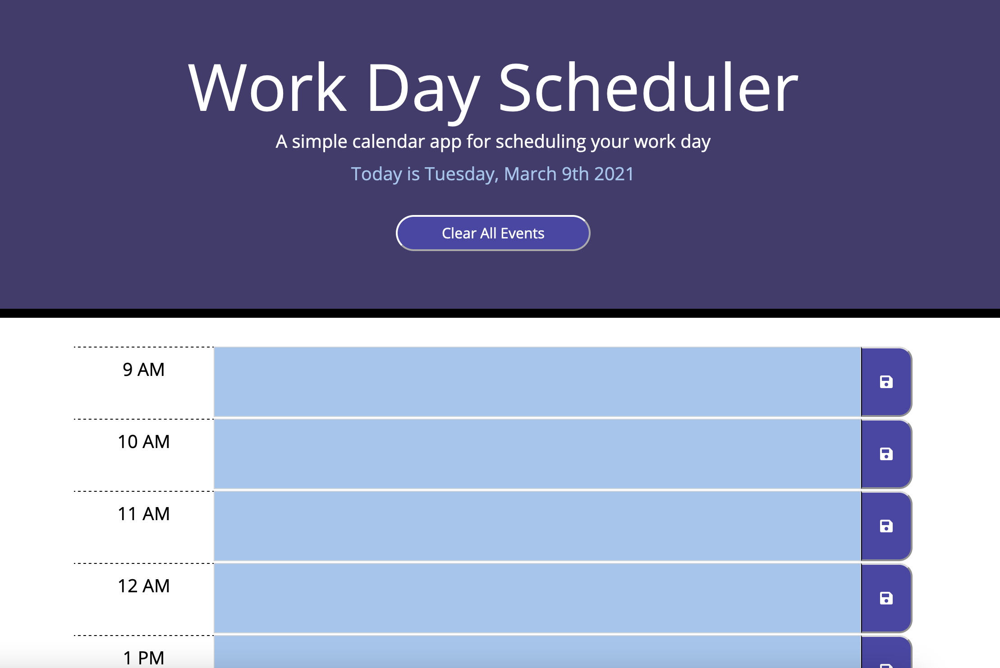

# Table of Contents:
* [Project Description](#Project)
* [Deployed Links](#Links)
* [Usage](#Usage)
* [Credits](#Credits)
* [License](#License)

# Project:
## Title:
# c05-Day-Planner

## Description:
As for our fifth week of homework for this assignment we (Columbia Engineering Bootcamp students) were given the following user story below and acceptance criteria:

## User Story

```
AS AN employee with a busy schedule
I WANT to add important events to a daily planner
SO THAT I can manage my time effectively
```

## Acceptance Criteria

```
GIVEN I am using a daily planner to create a schedule
WHEN I open the planner
THEN the current day is displayed at the top of the calendar
WHEN I scroll down
THEN I am presented with timeblocks for standard business hours
WHEN I view the timeblocks for that day
THEN each timeblock is color coded to indicate whether it is in the past, present, or future
WHEN I click into a timeblock
THEN I can enter an event
WHEN I click the save button for that timeblock
THEN the text for that event is saved in local storage
WHEN I refresh the page
THEN the saved events persist
```

This homework was not as bad as the previous assignments but definitely got tricky handling moment library and working with siblings and children traversing the DOM in Jquery. However it only took me a few hours to figure out.

Thanks for reading!

#Links
## Deployed Link:
https://defy1x.github.io/c05-Day-Planner/

#Usage
## Final screenshot


This is my day planner. I am very proud of this.

#Credits
Thank you to everyone who participated on the group zoom call on Wednesday 3/03/2021 within Columbia Bootcamp.

#License
MIT License

Copyright (c) 2021 Casandra McDonald

Permission is hereby granted, free of charge, to any person obtaining a copy
of this software and associated documentation files (the "Software"), to deal
in the Software without restriction, including without limitation the rights
to use, copy, modify, merge, publish, distribute, sublicense, and/or sell
copies of the Software, and to permit persons to whom the Software is
furnished to do so, subject to the following conditions:

The above copyright notice and this permission notice shall be included in all
copies or substantial portions of the Software.

THE SOFTWARE IS PROVIDED "AS IS", WITHOUT WARRANTY OF ANY KIND, EXPRESS OR
IMPLIED, INCLUDING BUT NOT LIMITED TO THE WARRANTIES OF MERCHANTABILITY,
FITNESS FOR A PARTICULAR PURPOSE AND NONINFRINGEMENT. IN NO EVENT SHALL THE
AUTHORS OR COPYRIGHT HOLDERS BE LIABLE FOR ANY CLAIM, DAMAGES OR OTHER
LIABILITY, WHETHER IN AN ACTION OF CONTRACT, TORT OR OTHERWISE, ARISING FROM,
OUT OF OR IN CONNECTION WITH THE SOFTWARE OR THE USE OR OTHER DEALINGS IN THE
SOFTWARE.
